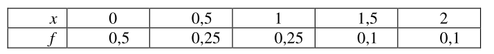
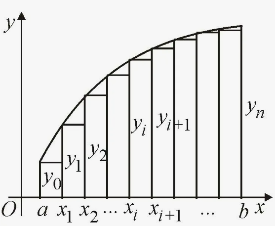
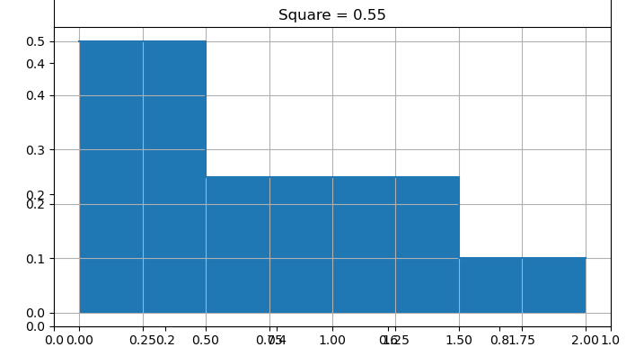
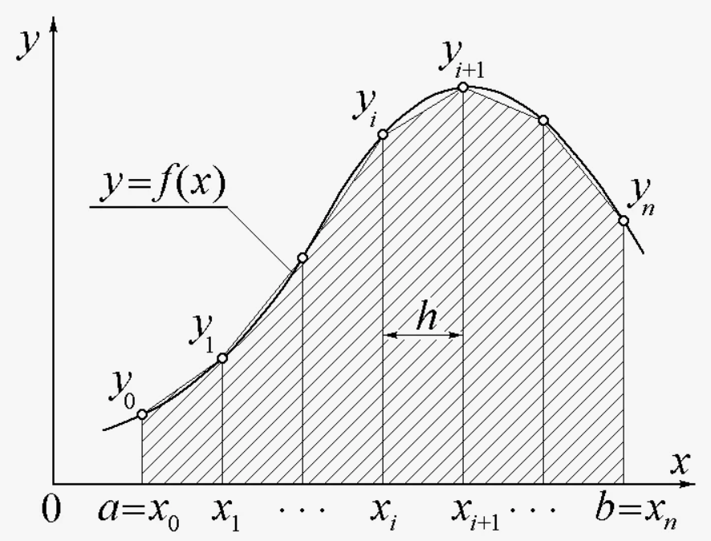
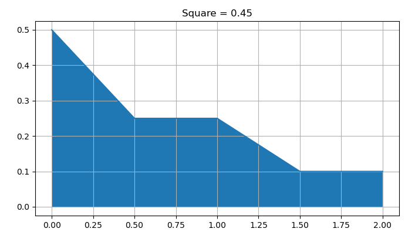
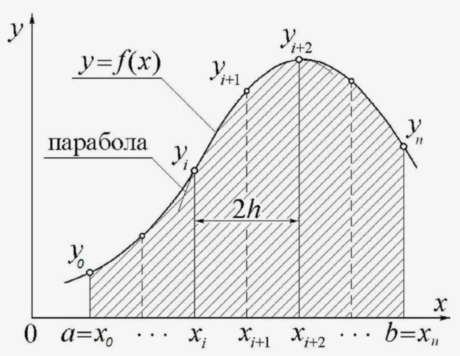
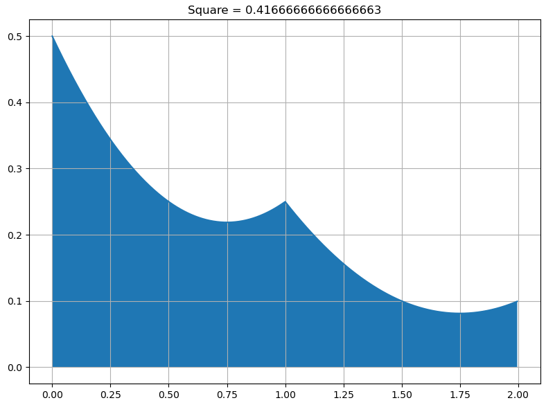
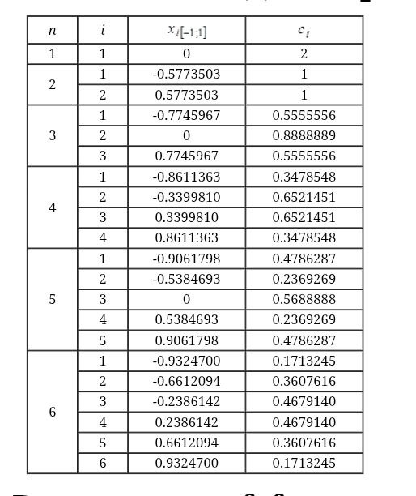

# Лабораторная работа №5. Численное интегрирование.

## Задание 

Раздел VII.9. Практические задачи :

Обязательная часть - любая задача из номеров 9.1 - 9.5

Реализовать методы Ньютона-Котеса: 
1) метод прямоугольников 
2) метод трапеций
3) метод симпсона
4) метод Гаусса - (можно искусственного ограничиться вычислением по 2,3,4 точкам)

Пусть будет вычислен VII.9.4:

## Метод прямоугольников 

Расчётная формула:

$$\int_{a}^{b}f(x)dx \approx h \sum_{i = 0}^{n - 1} f_i$$

Оценка ошибки:

$$\triangle \le max_{[a,b]}|f'(x)|\frac{b - a}{2}h$$

**Результаты:**

## Метод трапеций 

$$\int_{a}^{b}f(x)dx \approx h \left [ \frac{f_0 + f_n}{2} + \sum_{i = 1}^{n - 1} f_i \right ]$$

$$\triangle \le max_{[a,b]}|f''(x)| \frac{b - a}{12} h^{2}$$

**Результаты:**

## Метод Симпсона

Приближение параболами

$$\int_{a}^{b} f(x) \approx \frac{h}{3} \left[ f_0 + f_n + 4 \sum_{i = 1}^{n / 2}f_{2i - 1} + 2 \sum_{i = 1}^{n / 2}f_{2i} \right]$$

$$\triangle \le \max_{[a,b]} |f^{IV}(x)|\frac{b - a}{180} h^4$$

**Результаты:**

Примечание: параболы для построения были вычислены при помощи numpy, потому что так быстрее. Хотя можно было использовать интерполяцию полиномом Ньютона по трём точкам, но уже пора спать.

## Метод Гаусса 

$$\int_{a}^{b}f(x)dx \approx \sum_{k = 1}^{n}C_k f(x_k)$$

Где $x_k$ и коэффициенты $C_k$ находятся из системы: 

$$C_1 + C_2 + ... + C_n = \int_{a}^{b}dx$$
$$C_1 x_1 + C_2 x_2 + ... + C_n x_n = \int_{a}^{b}xdx$$
$$. . .$$
$$C_1 x_1^{m} + C_2 x_2^{m} + ... + C_n x_n^{m} = \int_{a}^{b}x^{m}dx$$

Где $m = 2n + 1$

При линейном отображении на [-1,1] можно воспользоваться таблицей коэффициентов 

Оценка ошибки:

$$\triangle \le \frac{(n!)^4(b-a)^{2n+1}}{[(2n)!]^3(2n + 1)} \max_{[a,b]} |f^{(2n)}|$$

Таблица предподсчитанных коэффициентов (для [-1,1]):

**Результаты:**

Здесь применялась интерполяция полиномом Ньютона из 4й лабораторной работы.

## Выводы

Было реализовано численное интегрирование методами прямоугольников, трапеций, Симпсона и Гаусса. Сложно оценить, какой метод наиболее точный, потому что точек всего 5. А теперь пора спать.