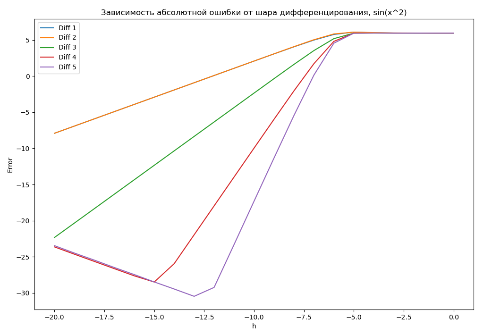
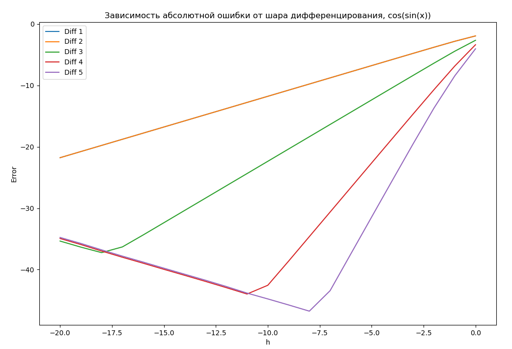
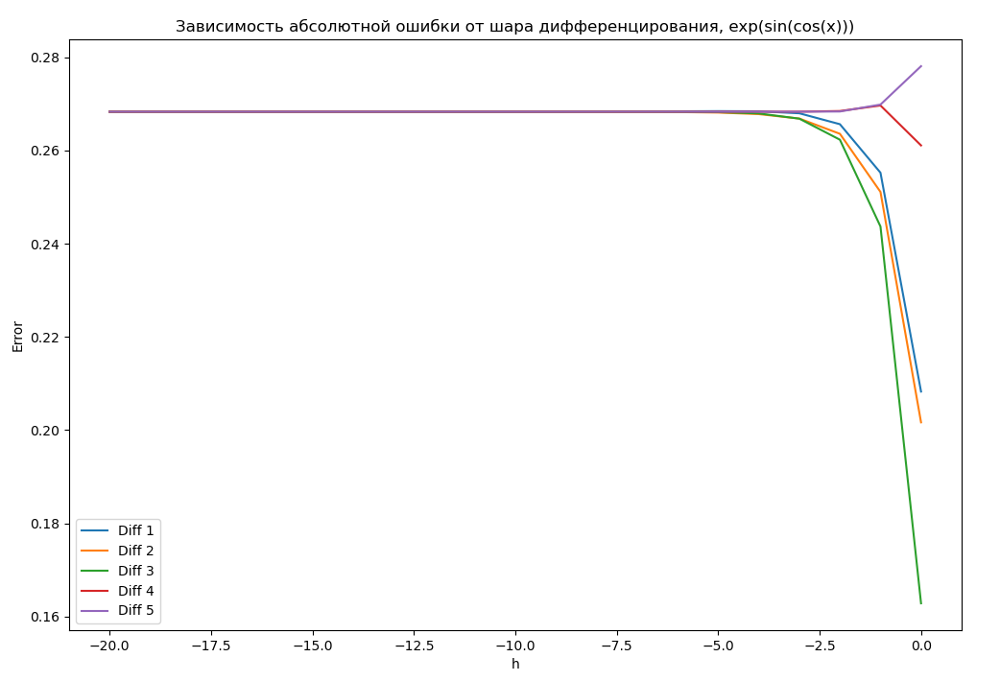
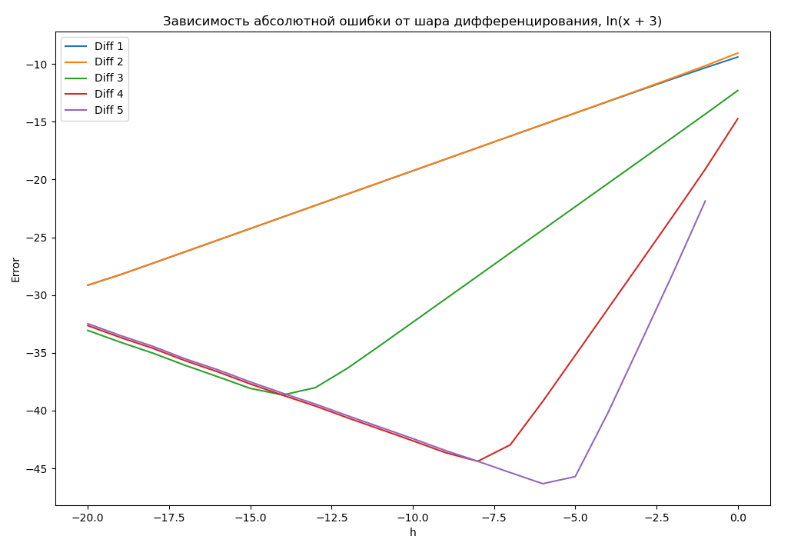
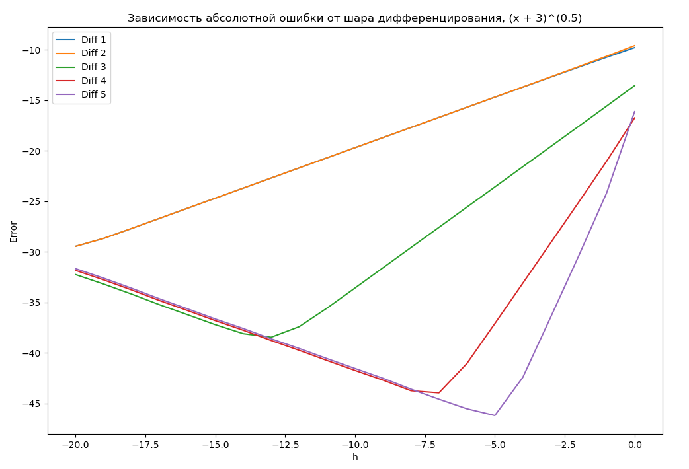

# Лабораторная работа 1.

## Задание
Посмтроить графики абсолютной погрешности каждого метода в зависимости от шага численного дифференцирования $h_n = \frac{2}{2^n}$, $n = \overline{1, 21}$ для функций

$sin(x^2), cos(sin(x)), exp(sin(cos(x))), ln(x + 3), (x + 3)^{0.5}$

Импользовать логарифмический масштаб по обеим осям. 

Список формул:

1. (Diff 1) $\frac{f(x + h) - f(x)}{h}$
2. (Diff 2) $\frac{f(x) - f(x - h)}{h}$
3. (Diff 3) $\frac{f(x + h) - f(x - h)}{2h}$
4. (Diff 4) $\frac{4}{3} \frac{f(x + h) - f(x - h)}{2h} - \frac{1}{3} \frac{f(x + 2h) - f(x - 2h)}{2h}$
5. (Diff 5) $\frac{3}{2} \frac{f(x + h) - f(x - h)}{2h} - \frac{3}{5} \frac{f(x + 2h) - f(x - 2h)}{4h} + \frac{1}{10} \frac{f(x + 3h) - f(x - 3h)}{6h}$

## Полученные графики

### $sin(x^2)$

### $cos(sin(x))$

### $exp(sin(cos(x)))$

### $ln(x + 3)$

### $(x + 3)^{0.5}$

## Анализ графиков
Как видно, для различных функций наименьшая ошибка достигается при разлияных $h$, отличных от $h_{min}$.
При этом $h \mapsto 0$ ошибка возрастает по сравнению со значением при $h_{opt}$. Это объясняется тем, что наращивается ошибка вычислительной машины, обусловленная конечным числом разрадов float чисел.
