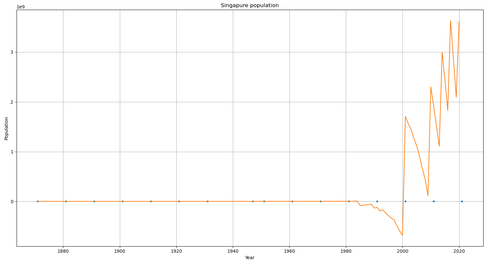
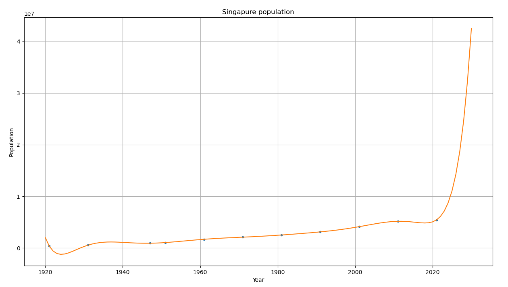
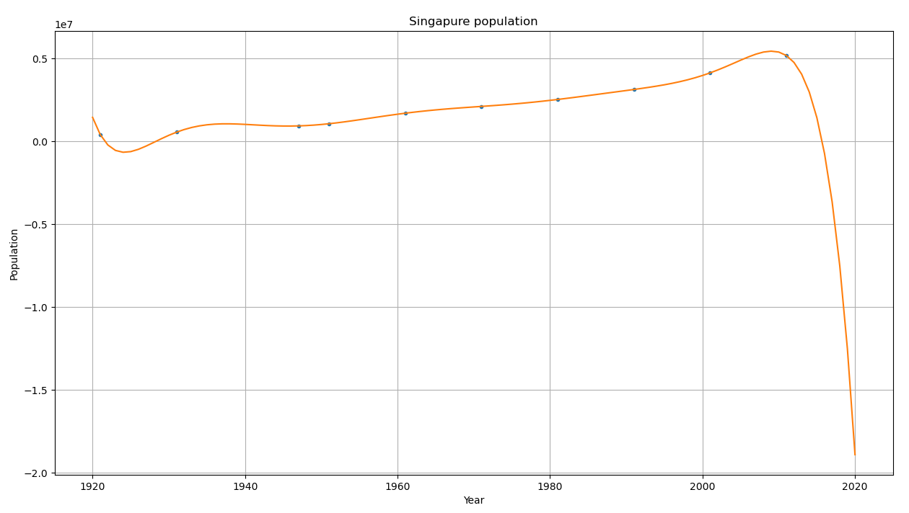
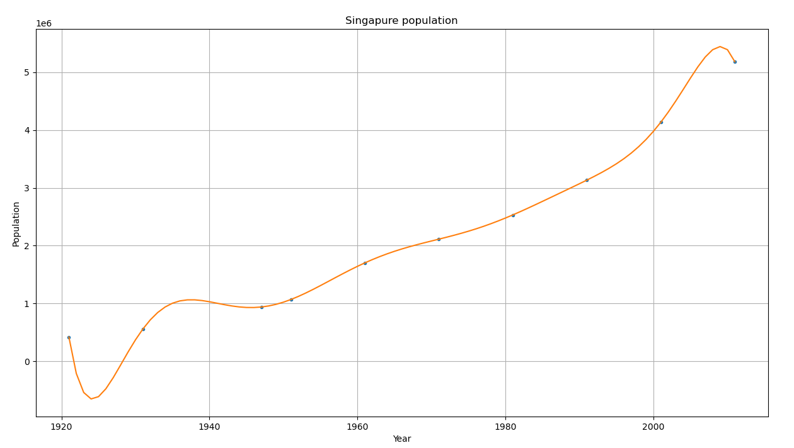
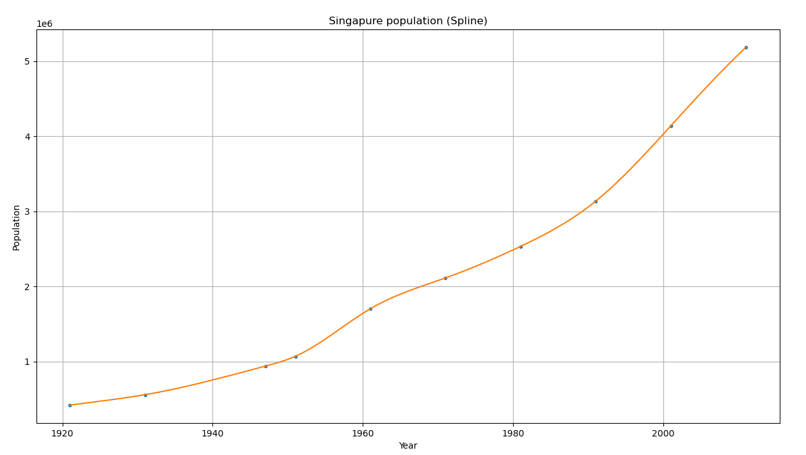

# Лабораторая работа №4

## Задание 

В условиях VI.9.29 решить задачу экстраполяции населения страны методами: 

1. Классическая полиномиальная интерполяция по Ньютону
2. Сплайн-интерполяция (обязательно собственная реализация метода трехдиагональной прогонки для определения коэффициентов/моментов сплайна).
3. Метод наименьших квадратов

## Данные

**VI.9.29:**

--// Данные о населении США с 1910 по 2000 с шагом 10 лет //--

1. По приведенным данным построить интерполянт в форме Ньютона. Вычислить экстраполированное значение численности населения США в 2010 году и сравнить с точным значением 308 745 538 человек.
2. По этим же данным построить сплайн-аппроксимацию, экстраполировать данные на 2010 год, сравнить с точным значением. Какие дополнительные условия для построения сплайна нужно поставить в этом случае?
3. Какой из результатов оказывается более точным?

**Выбранные данные:**
Страна: *Сингапур*.
Источник: *Википедия*.

| Год   | Население |
|-------|--------|
| 1871  | 97 111 |							
| 1881	| 137 755							
| 1891	| 181 612							
| 1901	| 227 592							
| 1911	| 303 321							
| 1921	| 418 358							
| 1931	| 557 745							
| 1947  | 938 144 
| 1951	| 1 068 100
| 1961	| 1 702 400
| 1971	| 2 112 900 
| 1981	| 2 532 835
| 1991	| 3 135 083
| 2001	| 4 138 012 
| 2011	| 5 183 688
| 2021	| 5 453 600

## Метод интерполяции полиномом в форме Ньютона

Интерполируем полиномом в форме Ньютона:
$$N(x) = b_0 + b_1(x - x_0) + b_2(x - x_0)(x - x_1) + ... + b_n(x - x_0)...(x-x_{n-1})$$

Находим коэффициенты согласно следующему процессу:

$$b_0 = f_0$$
$$b_1 = \frac{f_1 - f_0}{x_1 - x_0} = f_1(x_0, x_1)$$
$$b_2 = \frac{\frac{f_2 - f_1}{x_2 - x_1} - \frac{f_1 - f_0}{x_1 - x_0}}{x_2 - x_1} = f_2(x_0, x_1, x_2)$$

Разделённая разность первого порядка:
$$f(x_i, x_{i+1}) = \frac{f(x_{i+1}) - f(x_i)}{x_{i+1} - x_i}$$

Таким образом, получается рекурентная операция по вычислению коэффициентов. 

### Результаты вычислений 

Если попробовать взять данные с 1871 по 2021 год, то получается 16 значений. Если аппроксимировать полиномом Ньютона, то получится полином 15 степени, коэффициенты которого при старших степенях будут порядка 0, но из-за ограниченной точности вычислений эти коэффициенты будут несколько отличаться от обычных, в результате получится "провальная" аппроксимация:

Поэтому для этого методы выкидываем первые 5 значений из рассчёта (хотя можно было и повысить точность вычислений, например, заменив float на float128).

Если оставить данные 2021 года, получится полином 10й степени: 

Если убрать данные 2021 года, получится приближение полиномом 9й степени:

Экстраполируя его на 2021 год, получаем нереалистичное значение, равное -26975740.

Как видно из графиков, *экстраполяция* полиномом Ньютона является ненадёжным методом. Это обусловлено тем, что приближение проводится полиномом слишком большой степени.

Рассмотрим подробнее участок, на котором проводилась аппроксимация:

Как видно, аппроксимация выглядит действительно близкой к реальности лишь с 1947 по 2001 год. Ближе к крайним значениям начинаются нереалистичные колебания.

## Сплайн-интерполяция (кубическая)

Приближение полиномами 3 степени.
$$P_3(x_i) = f_i$$

$$S_i(x) = a_i + b_i(x - x_i) + \frac{1}{2}c_i(x - x_i)^2 + \frac{1}{6}d_i(x - x_i)^3$$
"Сшивка":
$$S'_i(x_i) = S'_{i+1}(x_i)$$
$$S''_i(x_i) = S''_{i+1}(x_i)$$

Используя условия для производных внутри узлов, получаем:
$$a_i = y_i$$
$$d_i = \frac{c_i - c_{i - 1}}{h_i}$$
$$b_i = \frac{h_i}{2}c_i - \frac{h_i^2}{6}d_i + \frac{y_i - y_{i-1}}{h_i}$$

Где $h_i = x_i - x_{i - 1}$. Для определения неизвестных
$c_i$ получаем систему

$$h_i c_{i - 1} + 2(h_i + h_{i + 1})c_i + h_{i + 1}c_{i + 1} = 6(\frac{y_{i + 1} - y_i}{h_{i + 1}} - \frac{y_i - y_{i - 1}}{h_i})$$

Добавляем краевые условия условия:
а. $S'(a) = f'(a)$
б. $S'(b) = f'(b)$
в. $S''(a) = f''(a), S''(b) = f''(b)$
  (Частный случай - $S''(a) = S''(b) = 0$)
г. $S(a) = S(b), S'(a) = S'(b)$
д. . . . 

Получаем систему с трёхдиагональной матрицей и решаем её методом прогонки.

### Результаты вычислений

Пусть краевые условия: $S''(a) = S''(b) = 0 = с_0 = с_N$.

Аппроксимирующий график:

Получается весьма реалистичная интерполяция.

## Выводы

Известно, что в Сингапуре за этот период времени глобальных изменений, сильно влияющих на численность населения, не происходило. 

