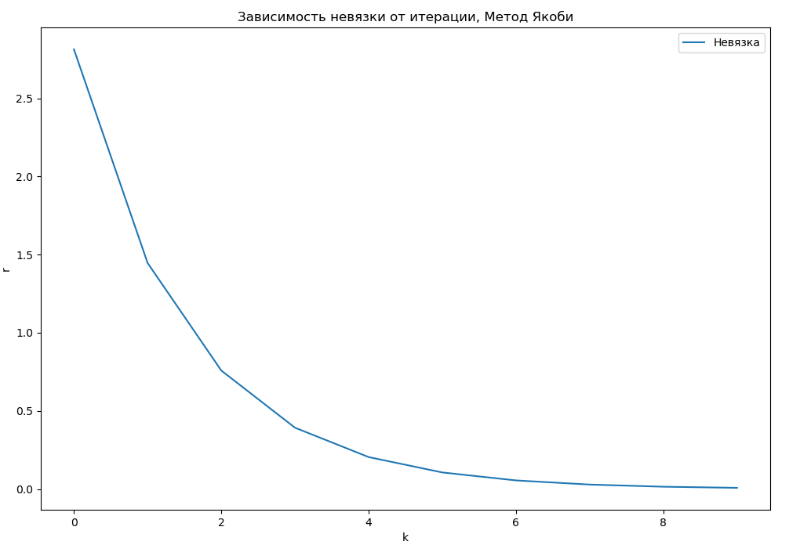
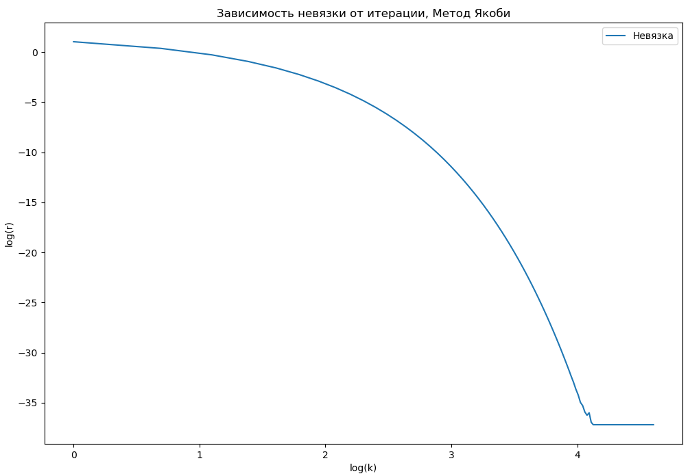
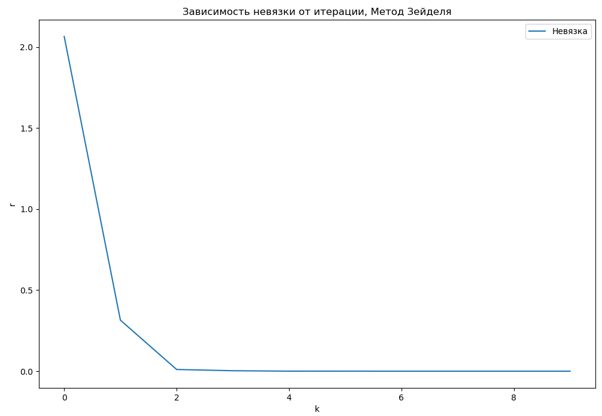
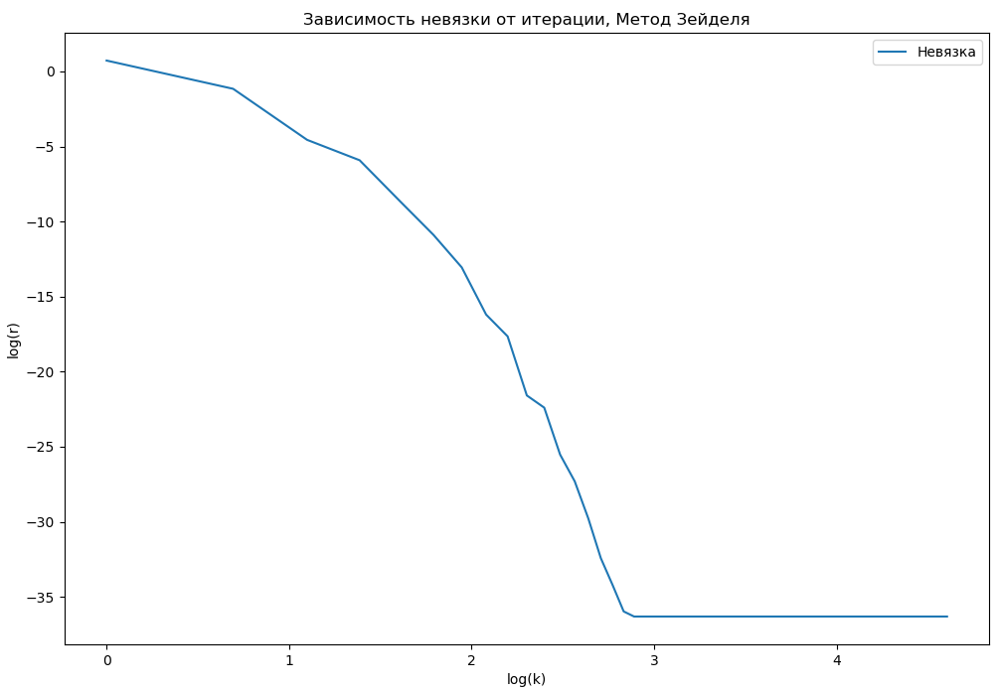
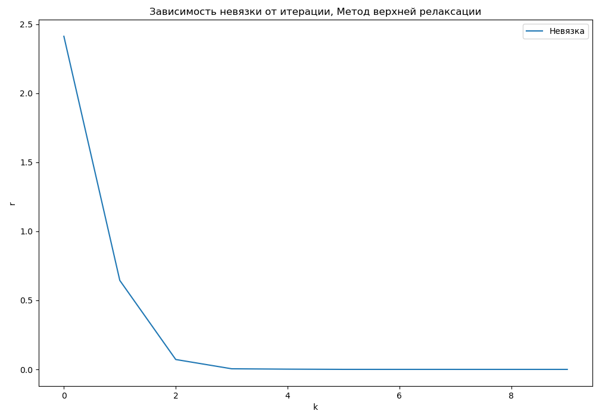
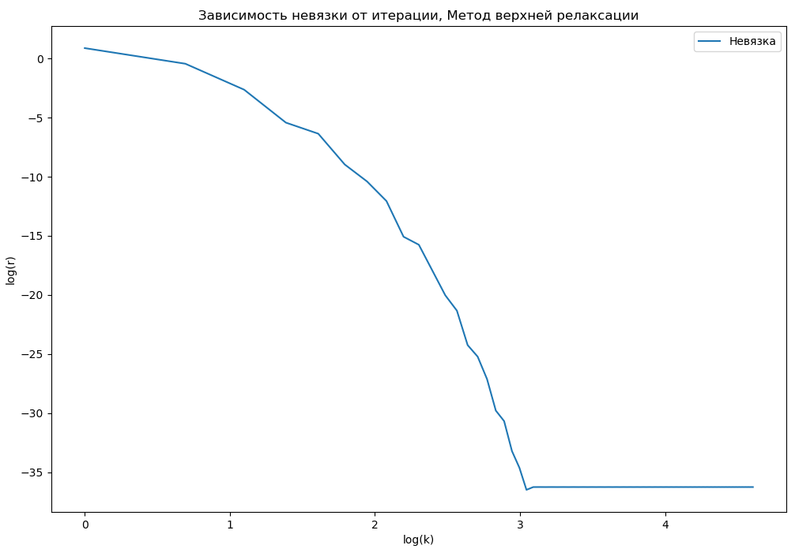
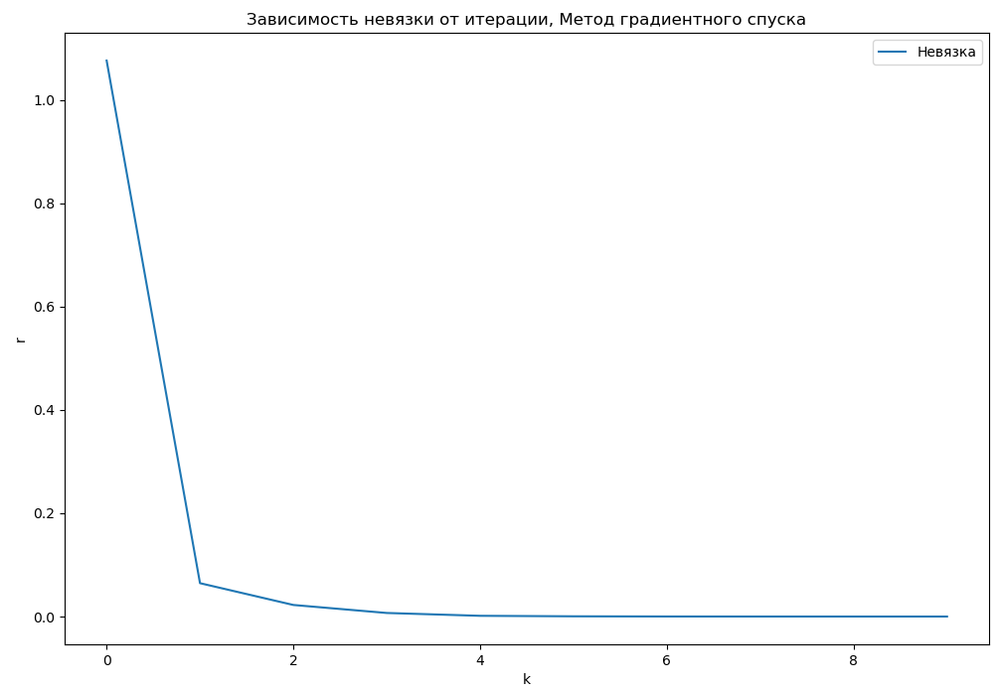
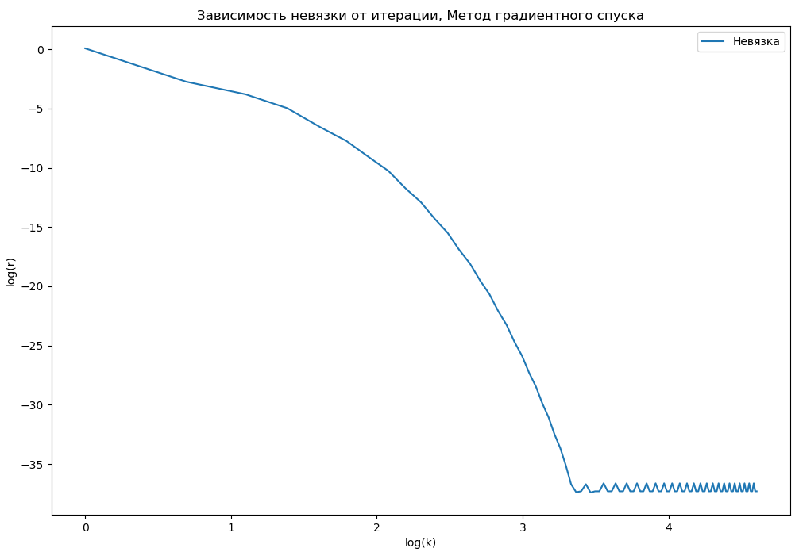
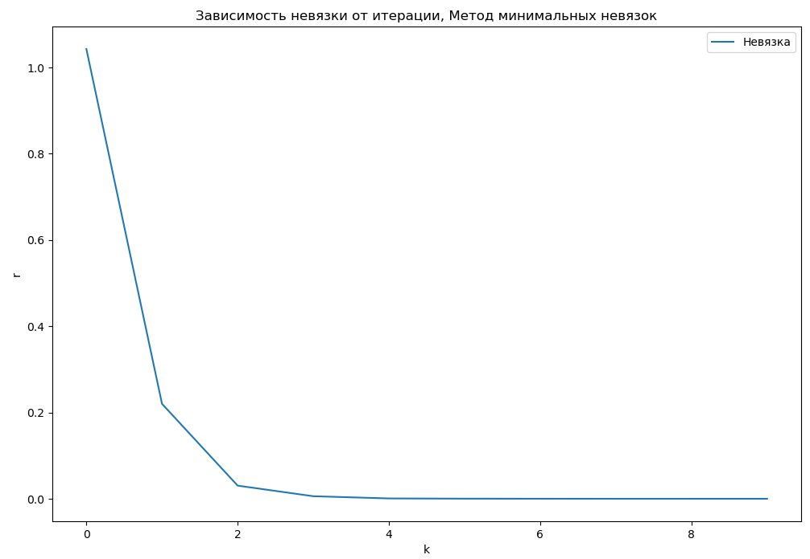
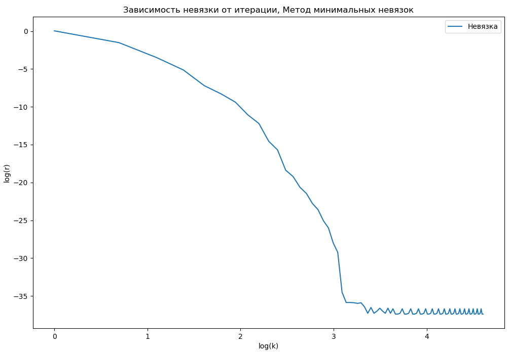

# Лабораторная работа №2

## Задание
Решить выбранную СЛАУ следующими методами (избежать умножения матриц, использовать поэлементные записи, методичек накидаю, где посмотреть): 

1. Метод Гаусса с выбором главного элемента
2. Метод LU-разложения (если применим)
3. Метод Якоби
4. Метод Зейделя
5. Метод верхней релаксации
6. Метод градиентного спуска
7. Метод минимальных невязок
8. Метод сопряженных градиентов и Стабилизированный метод бисопряженных градиентов

Для итерационных методов получить график убывания невязки в зависимости от итерации.

СЛАУ выбираются из номера II.10.5. из Практикума Аристова_Лобанов_Завьялова.

## Описания методов
Рассматриваемые СЛАУ имеют вид $Ax = b$.

Общие обозначения матриц:
$D = diag(A)$
$L$ - нижняя треугольная часть $A$
$U$ - верхняя треугольная часть $A$
$A = L + D + U$

### 1. Метод гаусса

**Метод гаусса** заключается в последовательном приведении с помошью элементарных преобразований матрицы $A$ к треугольному виду, из которой последовательно находятся все переменные системы. 

**Сложность:** $O(n^3)$

**Минусы:** является неустойчивым для плохо обусловленных матриц.

### 2. Метод LU-разложения

**Идея:** представить матрицу $A$ в виде произведения нижней треугольной матрицы $L$ и верхней треугольной матрицы $U$: $A = LU$. Затем вычисляется вспомогательный вектор $y$, через который вычисляется $x$:
$$Ly = b, Ux = y$$

### 3. Метод Якоби

Нахождение решения *итеративным способом*.

$$x_{k+1} = B x_{k} + g$$

Где $g = D^{-1}b$,  $B = -D^{-1}(L + U)$

**Критерий сходимости:** $|\lambda_{i}(B)| < 1, i = \overline{1, n}$

### 4. Метод Зейделя

То же самое, что и метод Якоби, только с $B = -(L+D)^{-1}U$ и $g = (L + D)^{-1}b$. 

**Критерий сходимости:** $||B|| < 1$

**Замечание:** хорошо работает только тогда, когда операция нахождения обратной матрицы  для $(L + D)$ оптимизирована с учётом того, что матрица $(L + D)$ треугольная. Иначе операция нахождения обратной матрицы может занимать больше времени, чем метод Гаусса (выявлено экспериментально в ходе работы).

### 5. Метод верхней релаксации

**Ограничения:** $A > 0$ и $A = A^{*}$, $\rho(T) < 1$

**Уравнение:** 
$$(\omega L + D)x_{k + 1} = - (\omega U + (\omega - 1)D)x_k + \omega B$$

Выбор *коэффициента релаксации*:

$$\omega = 1 + \left[ \frac{\rho(T)}{1 + \sqrt{1 - \rho(T)^2}} \right]^2$$

где $T = E - D^{-1} A$, $\rho(T) = \max{\lambda_i(T)}$ - спектральный радиус матрицы.

**Минусы:** перед основным вычислением требуется также вычисление $\rho(T)$.

### 6. Метод градиентного спуска

**Ограничения:** работает только при соблюдении условия, что $A^{*} = A$ (матрица симметрична).

**Идея решения**: рассмотрим функционал $\Phi(x) = (Ax, x) - 2(b, x)$ и устремим его к $\min$ по $x$. В точке минимума $grad \Phi(x) = 0 = 2(Ax - b)$, откуда получается, что это и есть нужное нам решение.

Итерация:

$$x_{k + 1} = x_{k} - \alpha_{k} \Phi(x_{k})$$

Учтём, что $grad \Phi(x) = 2(Ax - b)$

Тогда **итерация**

$$x_{k + 1} = x_{k} - \tau_k (Ax_k - b)$$

Наилучшее значение $\tau$ - при $\Phi(\tau_k)_{\tau_k}' = 0$, откуда 

$$\tau_{k} = \frac{(r_k, r_k)}{(Ar_k, r_k)}$$

где $r = Ax_k - b$ - *невязка*.

### 7. Метод минимальных невязок

**Ограничения:** $A = A^{*}$

**Идея решения:** Устремить невязку к 0.

**Итерация:**

$$x_{k + 1} = x_{k} - \tau_k r_k$$

Разность невязок при двух итерациях:

$r_{k + 1} - r_{k} = A(x_{k + 1} - x_{k}) = -\tau_{k} A r_{k}$
$r_{k + 1} = r_{k} - \tau_k A r_k$

$(r_{k + 1}, r_{k + 1}) = (r_k, r_k) - 2 \tau_k (A r_k, r_k) + \tau_{k}^{2}(A r_k, A r_k))$

Условие самого "эффективного" $\tau_k$: $(r_{k + 1}, r_{k + 1})_{\tau_k}' = 0$. То есть выбираем $\tau_k$ таким, чтобы следующая невязка $r_{k + 1}$ была наименьшей, для чего находим экстремум.

Откуда 

$$ \tau_k = \frac{(A r_k, r_k)}{(A r_k, A r_k)}$$

## Сравнение методов

Все методы на примере решения вариантв (у) оказались достаточно эффективными в решении. Ошибка вычислений за 10 итераций у итерационных методов мала по сравнению со значениями. Наилучшее время показал метод LU-разложения, потому что он использвет наименьшее количество операций из всех методов. Самое худжее время - метод верхней релаксации, это обусловлено тем, что метод помимо основных вычислений вычислял ещё и $\lambda_{max}$.

## Запуск программы

Убедитесь, что у Вас предустанвлен модуль numpy.

Запуск программы из папки /Second: `python3 main.py`.

Данные выводятся в CSV файл results.scv. На git сохранены реультаты, получившиеся на моём компьютере.

## Заключение

В ходе выполнения лабораторной работы были изучены и реализованы указанные в задаче методы решения СЛАУ. Также были релизованы переиспользуемые компопненты, такие как класс Matrix и дополнительные функции для работы с матрицами, которые могут быть использованы в следующих работах.