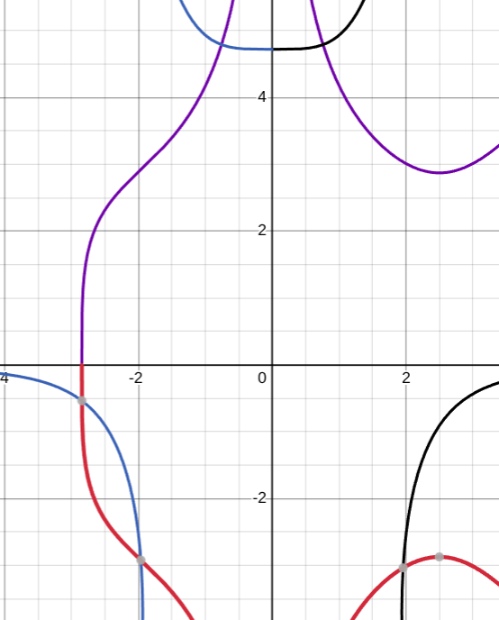

# Лабораторная работы №3.

## Задание

1. Выбрать любые два нелинейных уравнения из IV.12.3.
2. Выбрать нелинейные системы по одной из IV.12.4 и IV.12.6.

Решить их следующими методами: 

0. Половинное деление
1. Метод простой итерации
2. Метод Ньютона, модифицированный метод Ньютона (методы хорд, парабол - по желанию)
3. *(со звёздочкой, "не для всех") Разобраться самостоятельно с вариационными методами решения нелинейных задач - раздел V.

## Выбранные уравнения

1. IV.12.3 (л): $x 2^{x} = 1$
2. IV.12.3 (к): $ln(x) + (x - 1)^{3} = 0$


3. IV.12.4 (в): $\begin{cases} cos(x - 1) + y = 0.5 \\ x - cosy = 3 \end{cases}$
4. IV.12.6 (д): $\begin{cases} x^{7} - 5 x^{2} y^{4} + 1510 = 0 \\ y^{3} - 3 x^{4}y - 105 = 0 \end{cases}$

**Ожидаемые решения:**
1. $x \approx 0.64$
2. $x \approx 1 $
3. $(x, y) \approx (3.36, 1.2)$
4. $(x, y) \approx \left[\begin{array}{ll}(0.76, 4.78) \\ (-0.76, 4.78) \\ (-2.84, -0.54) \\ (-1.96, -2.91) \\(1.95, -3.03)\end{array}\right.$


<p align="center">
    
    <br>
    <em>Для оценки корней 4й системы</em>
</p>

## Описания методов

### Общий принцип
1. Локализуем корни (задаём область, которую будем исследовать на наличие корней)
2. Решаем одним из методов.

### 0. Метод половинного деления

Простейший *итерационный метод* нахождения корней нелинейного уравнения. 

Для начала итерации необходимо задать отрезок, на концах которого функция принимает значения разных знаков. 

На каждом шаге итерации исследуется на наличие корней отрезок [a, b]. Вычисляются значения функции $f(a), f((a + b) / 2)$ и $f(b)$. Для следующий итерации выбирается один из отрезков (или оба), удовлетворяющий условию $f(x_1)f(x_2)$ < 0.

**Сложность**: $O(n m)$ для точности $\varepsilon = (a-b)/2^{n}$, где m - количество корней на отрезке [a, b].

**Огреничения**: требуется непрерывность $f(x)$ на начальном отрезке.

### 1. Метод простой итерации

Для начала приводим уравнение $f(x) = 0$ к виду $x = \phi(x)$. После задания начального приближения $x_0$ итерации проводятся по схеме: $x_{k + 1} = \phi(x_k)$.

**Условия сходимости:** 
1. $\phi(x)$ определена и дифференцируема на [a, b]
2. Значения $\phi(x)$ принадлежат [a, b]
3. $|\phi'(x)| < 1$ для всех $x$ из [a, b]

В случае с системами уравнений вместо производной вычисляется якобиан.

### 2. Метод Ньютона, модифицированный метод Ньютона

$x_{k + 1} = x_k - \frac{f(x_k)}{f'(x_k)}$

Модификация: 

$x_{k + 1} = x_k - \frac{f(x_k)}{f'(x_0)}$

В случае с системами уравнений вместо производной вычисляется якобиан.

## Резульаты:

Заданная компьютеру погрещность вычислений:

$\varepsilon = 0.00001$

| Уравнение | Половинное деление | МПИ | Метод Ньютона | Мод. Метод Ньютона
|-------------|-------------|-------------|-----------|----|
| $x 2^{x} = 1$ | 0.641186 | 0.641184 | 0.641186 | 0.641186 |
|$ln(x) + (x - 1)^{3} = 0$| 1.00000 | 1.0 | 1.0 | 1.0 |
|$\begin{cases} cos(x - 1) + y = 0.5 \\ x - cosy = 3 \end{cases}$ | - | (3.35917, 1.206909) | (3.355912, 1.206907) | (3.355911, 1.206907)|
|$\begin{cases} x^{7} - 5 x^{2} y^{4} + 1510 = 0 \\ y^{3} - 3 x^{4}y - 105 = 0 \end{cases}$| - | - | $\begin{gathered} (1.954881, -3.034004) \\ (-2.844480, -0.535416) \\ (-1.962410, -2.918994) \\ (0.758168, 4.787727) \\ (-0.758103, 4.787703) \end{gathered}$ | $\begin{gathered} (1.954880, -3.034004) \\ (-2.844482, -0.535420) \\ (-1.962410, -2.918995) \\ (0.758171, 4.787724) \\ (-0.758106, 4.787699) \end{gathered}$ |

Для нахождения всех решений 4й системы пришлось подбирать различные x0, чтобы методы сходились к различным корням.

**Замечания:**
1. Для 4й системы не удалось найти сходящуюся функцию $\phi$ для подсчёта МПИ. 

2. Для 4й системы при удалении от корней модифицированный метод Ньютона перестаёт сходится, числа уходят в пределы. При этом обычный метод Ньютона по-прежнему сходится. Поэтому для нахождения корней приходится брать достаточно близкий к корню $x_0$.

## Запуск программы

```
python3 main.py
```

## Выводы
Бали реализованы и применены на практике следующие методы для решения нелинейных уравнений: 
1. Половинное деление
2. Метод простой итерации
3. Метод Ньютона, модифицированный метод Ньютона 

Для решения систем нелинейных уравнений: 
1. Метод простой итерации
3. Метод Ньютона, модифицированный метод Ньютона 

Замечено, что для МПИ не всегда получается легко найти функцию $\phi$, удовлетворяющую условию сходимости. Также замечено, что и (модифицированный) метод Ньютона может расходиться, если задать $x_0$ далеко от корня.

